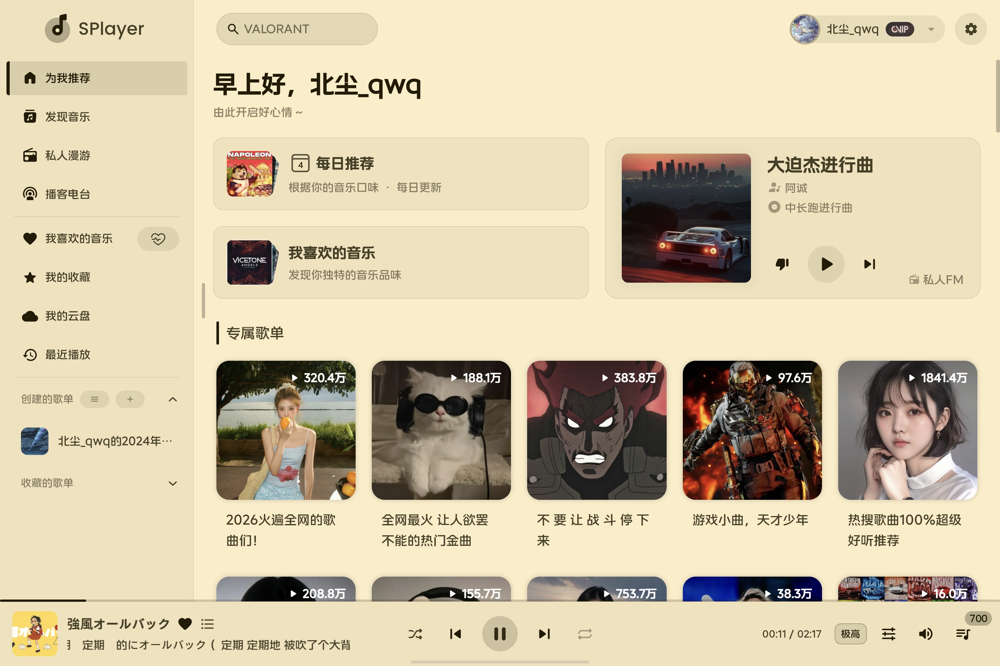
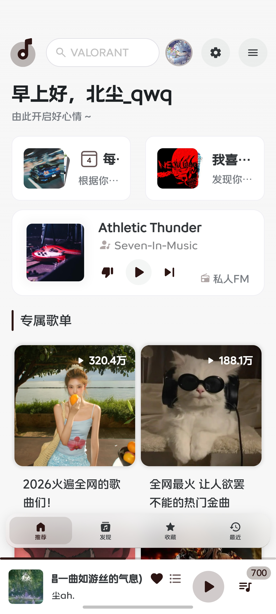
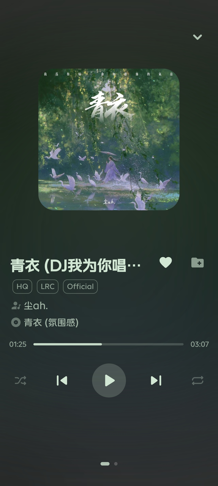
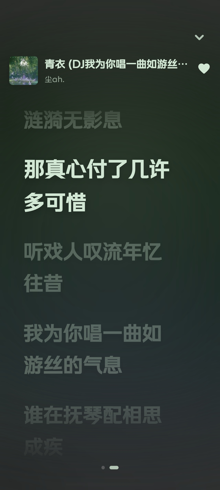

# SPlayer for Android

基于 [SPlayer](https://github.com/imsyy/SPlayer) 修改与移植的 Android 音乐播放器，面向 Android 手机与平板，使用 `Vue 3 + Naive UI + Capacitor` 构建，并内置本地 API 运行能力。

当前版本：`v3.0.0-beta.1`

## 项目简介

SPlayer for Android 以原版 SPlayer 为基础，保留了逐字歌词、流媒体接入、本地音乐管理和播放器核心体验，并针对 Android 平台重做了构建链路、运行方式与移动端交互。

当前仓库仅保留 Android 相关源码和构建内容，不再包含 Electron 桌面端主进程与桌面打包链路。

## 界面预览

### 平板界面




### 手机界面







## 特性

- 支持 Android 11 及以上系统
- 支持 Android 手机与平板布局适配
- 基于 `Vue 3 + TypeScript + Naive UI + Capacitor`
- 内置 `nodejs-mobile-cordova` 本地 API
- 支持沉浸式状态栏与全屏播放器体验
- 支持逐字歌词、全屏播放器、歌单与流媒体页面
- 支持 Jellyfin / Navidrome / Emby 等流媒体服务

## 仓库结构

- `src`：前端界面与播放器逻辑
- `android`：Android 原生工程
- `API`：内置本地 API 入口与服务代码
- `scripts`：Android 内置 Node 构建与资源准备脚本
- `capacitor.config.ts`：Capacitor 配置

## 播放方案

Android 端当前默认使用 `HTMLAudioElement` 直连播放，而不是完整的桌面端 Web Audio 播放链路。这样做的主要原因是：

- 更适合 Android WebView 环境
- 后台播放更稳定
- 更容易控制功耗与兼容性

当前已知取舍：

- 不启用 `equalizer`
- 不启用 `spectrum`
- 不启用 `setSinkId`

相关实现位于：

- `src/core/audio-player/AudioElementPlayer.ts`
- `src/core/audio-player/BaseAudioPlayer.ts`

## 环境要求

- Node.js `>= 20`
- pnpm `>= 10`
- JDK `21`
- Android Studio
- Android SDK / NDK

## 本地开发与构建

1. 安装依赖

```bash
pnpm install
```

2. 构建 Web 资源

```bash
pnpm build:web
```

3. 构建 Android 内置 Node 资源

```bash
pnpm build:android:node
pnpm prepare:android:embedded
```

4. 同步 Capacitor Android 工程

```bash
npx cap sync android
```

5. 生成调试 APK

```bash
cd android
./gradlew assembleDebug
```

生成产物：

```text
android/app/build/outputs/apk/debug/app-debug.apk
```

如果希望直接执行完整的 Android 资源准备流程，可以使用：

```bash
pnpm build:android
```

## 在 Android Studio 中运行

1. 打开 Android 工程

```bash
npx cap open android
```

2. 等待 Gradle 同步完成
3. 选择真机或模拟器
4. 运行 `app`
5. 或使用 `Build > Build APK(s)` 生成安装包

## GitHub Actions 发布

仓库已包含手动触发的 Android Release 工作流，可以通过 GitHub 的 `Run workflow` 手动构建并发布 APK。

如果需要签名发布，请先配置以下 GitHub Secrets：

- `ANDROID_KEYSTORE_BASE64`
- `ANDROID_KEYSTORE_PASSWORD`
- `ANDROID_KEY_ALIAS`
- `ANDROID_KEY_PASSWORD`

相关说明见：

- `.github/ANDROID_RELEASE_SECRETS.md`

## 当前说明

- 当前仓库定位为 Android 版本仓库
- 不包含原 Electron 桌面端打包链路
- 手机端界面仍在持续做适配优化

## 致谢

本项目基于原项目 [SPlayer](https://github.com/imsyy/SPlayer) 进行修改、移植与 Android 化适配。

感谢原作者及贡献者提供的设计、功能与代码基础。

## 许可证

本项目遵循上游项目许可证：

`AGPL-3.0`
