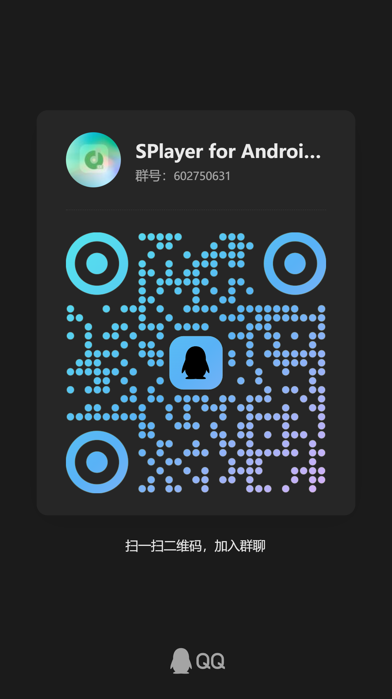

# 🎵 SPlayer for Android

<p align="center">
  
  
  
  
  
  
</p>

> 基于 [**SPlayer**](https://github.com/imsyy/SPlayer) 移植与重做的 Android 音乐播放器。保留原版精华，针对手机与平板彻底重构交互——**一个能装进口袋的 SPlayer** 🎶

---

## 📸 界面预览

<table>
<tr>
  <td align="center"><b>📱 手机</b></td>
  <td align="center"><b>💻 平板</b></td>
</tr>
<tr>
  <td></td>
  <td></td>
</tr>
<tr>
  <td></td>
  <td></td>
</tr>
<tr>
  <td></td>
  <td></td>
</tr>
</table>

---

## ✨ 特性一览

| 分类 | 描述 |
| --- | --- |
| 🎨 **双端 UI** | 手机 / 平板自适应布局，沉浸式全屏，状态栏可切换 |
| 🎵 **播放引擎** | 基于 `HTMLAudioElement`，WebView 下长时间后台稳定 |
| 📝 **逐字歌词** | 毫秒级插值高亮，翻译 / 罗马音，拖动吸附最近行 |
| 🪟 **桌面歌词** | `WindowManager` 悬浮窗，逐字动画、锁定穿透、拖拽、播控 |
| 🔔 **通知栏** | 原生 `MediaSession`，完整播控，支持桌面歌词一键开关 |
| 🎚️ **精细控制** | 渐入渐出、进度吸附歌词、允许与其他应用同时播放 |
| 🌐 **在线音乐** | 网易云 + Jellyfin / Navidrome / Emby / Subsonic / Last.fm |
| 🧩 **内置 API** | `nodejs-mobile-cordova` 嵌入网易云 API，离线可用 |
| 📦 **分架构打包** | `arm64-v8a` / `armeabi-v7a` / `x86_64` / `x86` 独立 APK |

---

## 📦 下载与安装

前往 [**Releases**](../../releases) 选择对应 CPU 架构的 APK：

| ABI | 适用设备 | 推荐度 |
| :---: | --- | :---: |
| **`arm64-v8a`** | 绝大多数现代手机 / 平板 | ⭐⭐⭐⭐⭐ |
| `armeabi-v7a` | 2015 年前的老旧 32 位 ARM 设备 | ⭐⭐ |
| `x86_64` | Intel 平板、Android 模拟器 | ⭐ |
| `x86` | 极少数 32 位 Intel 设备 | ⭐ |

> 💡 不清楚自己设备架构？装个 **CPU-Z**，或者无脑选 `arm64-v8a`——99% 都是它。

---

## 🆕 v3.0.0-rc.2 更新

- 🔄 修复 **横竖屏切换** 时部分界面布局错乱
- 📱 修复 **手机小屏** 下文字挤压成一团的问题
- ⬆️ 调整 **"回到顶部"按钮** 位置，不再遮挡其他控件
- 🎨 修复 **桌面歌词** 在未开启文本背景遮罩时、锁定状态下仍显示背景的 bug
- 📦 GitHub Actions 构建改为 **分架构打包**，单包体积更小

---

## 🚀 快速开始

### 环境要求

| 工具 | 版本 |
| --- | --- |
| Node.js | `>= 20` |
| pnpm | `>= 10` |
| JDK | `21` |
| Android SDK / NDK | 最新 |

### 一键构建

```bash
pnpm install
pnpm build:android
cd android && ./gradlew assembleDebug
```

产物：`android/app/build/outputs/apk/debug/`（按 ABI 分包）

### 分步构建

```bash
pnpm build:web                  # 前端 Vite 构建
pnpm build:android:node         # 内置 Node API Bundle
pnpm prepare:android:embedded   # 准备嵌入资源
npx cap sync android            # 同步 Capacitor 工程
npx cap open android            # Android Studio 打开
```

---

## ❓ FAQ

<details>
<summary><b>🔑 桌面歌词打不开，提示需要权限？</b></summary>

<br>

需要授予 **SYSTEM_ALERT_WINDOW（显示在其他应用上层）** 权限。首次启用会自动引导，如果拒绝过，可以去 **系统设置 → 应用 → SPlayer → 权限** 里手动开启。

</details>

<details>
<summary><b>🎧 想和其他应用同时播放？</b></summary>

<br>

进入 **设置 → 播放 → 允许与其他应用同时播放**。

> ⚠️ 注意：当前 Android 播放走 `HTMLAudioElement`，该选项的实际效果依赖 WebView 版本与系统音频焦点策略，部分设备上行为可能不完全一致。

</details>

<details>
<summary><b>📦 我该下载哪个 APK？</b></summary>

<br>

无脑选 **`arm64-v8a`**。只有极老的设备（通常 2015 年前）才需要 `armeabi-v7a`。`x86` / `x86_64` 几乎只用于模拟器。

</details>

<details>
<summary><b>🖥️ 能在电脑上运行吗？</b></summary>

<br>

本仓库已剥离 Electron 桌面端打包链路，**仅保留 Android 构建**。需要桌面版请前往 [原版 SPlayer](https://github.com/imsyy/SPlayer)。

</details>

<details>
<summary><b>🔕 通知栏控制器不显示？</b></summary>

<br>

1. **设置 → 播放** 里打开 **"通知栏音乐控制器"**
2. 系统设置里允许 SPlayer 发送通知（Android 13+ 首次启用会弹权限框）

</details>

<details>
<summary><b>🌙 支持后台播放吗？</b></summary>

<br>

支持。通知栏控制器启用后，应用进入后台仍会继续播放，不会被系统快速回收。

</details>

---

## 💬 交流 & 反馈

<table>
<tr>
  <td width="260" align="center">
    
  </td>
  <td valign="middle">
    <b>SPlayer for Android 交流群</b><br>
    <br>
    群号：<code>602750631</code><br>
    一键加群：<a href="https://qm.qq.com/q/AjIqKftqgM">https://qm.qq.com/q/AjIqKftqgM</a><br>
    <br>
    群内可讨论使用问题、交流经验，也欢迎反馈 Bug。<br>
    <b>⚠️ Bug 反馈仍建议优先</b> <a href="../../issues">提交 Issue</a>，便于跟踪与修复。
  </td>
</tr>
</table>

---

## 🤖 CI / 发布

手动触发 [`Android Release`](./.github/workflows/android-release.yml) 工作流即可分架构构建 & 发布 APK。

签名所需 Secrets：

| Secret | 说明 |
| --- | --- |
| `ANDROID_KEYSTORE_BASE64` | Keystore 的 Base64 编码 |
| `ANDROID_KEYSTORE_PASSWORD` | Keystore 密码 |
| `ANDROID_KEY_ALIAS` | Key 别名 |
| `ANDROID_KEY_PASSWORD` | Key 密码 |

详细说明见 [`.github/ANDROID_RELEASE_SECRETS.md`](./.github/ANDROID_RELEASE_SECRETS.md)。

---

## 🧑‍💻 参与贡献

欢迎提 Issue 与 PR！提交前请先阅读 [**CONTRIBUTING.md**](./CONTRIBUTING.md)，了解 Issue / PR / Commit 规范。

- 🐞 [提交 Bug](../../issues/new?template=bug.yml)
- ✨ [提交功能建议](../../issues/new?template=feature.yml)
- 📮 [发起 Pull Request](../../compare)

### 👥 贡献者

感谢每一位为本项目付出时间与代码的伙伴 ❤️

<a href="https://github.com/SPlayer-Dev/SPlayer-for-Android/graphs/contributors">
  
</a>

> 图片由 [contrib.rocks](https://contrib.rocks) 自动生成，随 GitHub 贡献图谱更新。

---

## 🤝 致谢

本项目基于 [**SPlayer**](https://github.com/imsyy/SPlayer) 移植，向原作者 [@imsyy](https://github.com/imsyy) 与所有贡献者致以最诚挚的感谢 ❤️

---

## 📄 许可证

[**AGPL-3.0**](./LICENSE) —— 与上游保持一致
